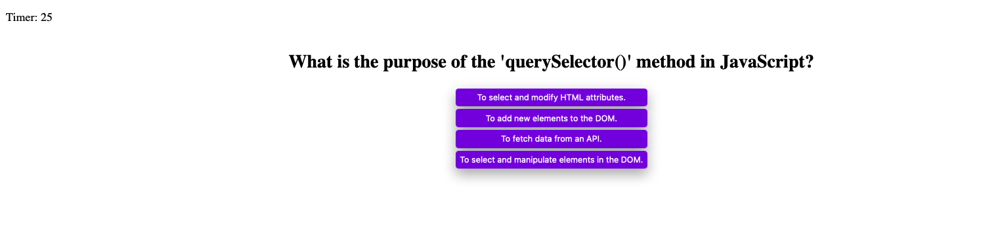

# CodeQuest: JavaScript Adventure Trivia

Welcome to CodeQuest: JavaScript Adventure Trivia! 🚀 Test your JavaScript knowledge and embark on an exciting journey through the world of coding and scripting. This interactive quiz game is designed to challenge your understanding of JavaScript concepts while providing an enjoyable learning experience.

## About

CodeQuest is a fun and engaging quiz game built with JavaScript. Whether you're a beginner learning the ropes or an experienced developer looking to refresh your skills, this trivia game has something for everyone. Explore a variety of JavaScript topics, from data types and functions to loops and events.

## Features

- 🎮 Interactive Gameplay: Dive into the captivating world of JavaScript trivia through an interactive and user-friendly interface.
- 🌟 Multiple Choice Questions: Test your knowledge with a diverse set of multiple-choice questions on JavaScript fundamentals.
- ⏱️ Time Challenge: Answer questions against the clock to keep the excitement high and challenge yourself.
- 🏆 Score Tracking: Keep track of your progress and compete with friends to see who can achieve the highest score.
- 🌐 Web-Based: Access the game directly from your web browser, making it easy to play anytime, anywhere.

## How to Play

1. Go to The website: https://jesk3r.github.io/codeQuest-javaScript-adventure-trivia/
2. Start the quiz and answer each question by selecting the correct option.
3. Your score will be calculated based on the number of correct answers and the time taken.
4. Aim for a high score and challenge your friends to beat it!

## Screenshots

---

Are you ready to embark on a CodeQuest and test your JavaScript knowledge? Get started now and challenge yourself with exciting JavaScript trivia!
